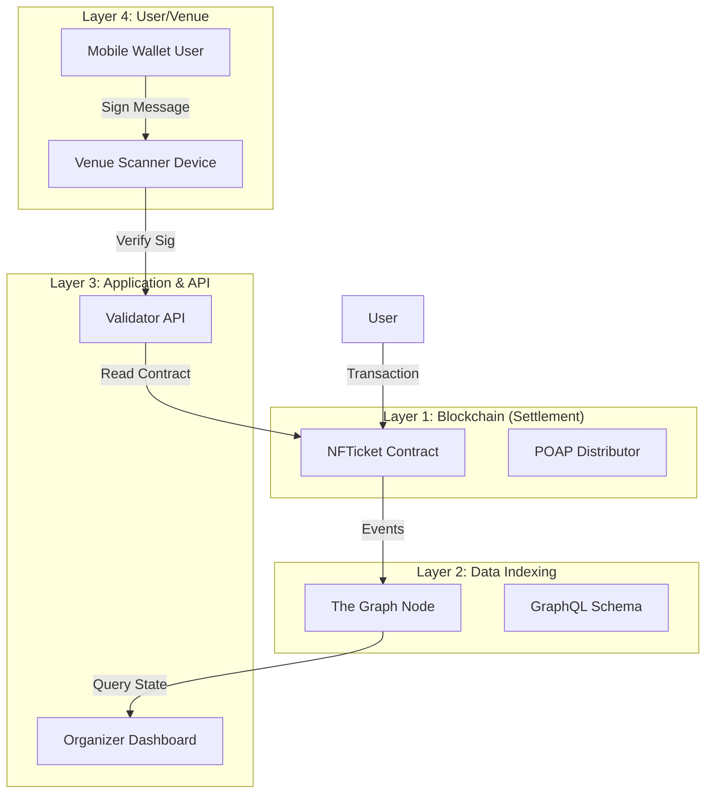

# NFTicket Protocol Architecture

**Author:** Md. Sowad Al-Mughni  
**Status:** Active  
**Version:** 1.0.0

## 1. Executive Summary

The NFTicket Protocol is a decentralized ticketing solution designed to eliminate scalping and fraud while maximizing organizer revenue through enforceable secondary market royalties.

This document details the architectural decisions, system components, data flow, and security models that underpin the protocol. It is intended for core contributors, auditors, and system integrators.

## 2. System Design Philosophy

### 2.1 Core Tenants
1.  **Trustlessness:** Ticket validity is cryptographically verifiable without reliance on a central database.
2.  **Sovereignty:** Organizers own their event data; users own their tickets (ERC-721).
3.  **Offline-First:** Venue verification must function without reliable internet access, utilizing strict cryptographic signatures.
4.  **Immutability:** Pricing and royalty logic are baked into the smart contract and cannot be bypassed.

### 2.2 Why ERC-721?
We chose the ERC-721 standard over ERC-1155 for the following reasons:
*   **Individuality:** Each ticket represents a specific seat or unique access right.
*   **Traceability:** Easier to simple ancestry tracking for audit trails.
*   **POAP Compatibility:** 1:1 mapping between Ticket ID and Attendance Proof.

## 3. High-Level Architecture

The system is composed of four primary layers:

## 4. Component Deep Dives

### 4.1 Smart Contracts (The "Law")
*   **`NFTicket.sol`:** Extends `ERC721` with `AccessControl`.
    *   *Anti-Scalping Logic:* Overrides `_beforeTokenTransfer` (or `_update` in v5) to check `msg.value` against `maxPrice` and divert `royaltyCap` % to the organizer.
    *   *State:* Maintains `ticketUsed` mapping to prevent replay attacks at the gate.

### 4.2 The Validator Oracle (The "Judge")
Located in `backend/api/`, this Express.js service acts as a bridge for the physical world.
*   **Role:** Verifies off-chain signatures from users' mobile wallets.
*   **Mechanism:**
    1.  User app generates a payload: `{ tokenId, timestamp, nonce }`.
    2.  User wallet signs payload: `SiweMessage` (Sign-In with Ethereum).
    3.  Scanner sends payload + signature to API.
    4.  API recovers address, verifies ownership on-chain, and checks `timestamp` delta (prevents replay).

### 4.3 The Subgraph (The "Librarian")
Direct blockchain queries are slow/expensive. We use The Graph to index:
*   `TicketMinted`
*   `TicketTransferred` (for sales volume analytics)
*   `RRoyaltyPaid`
This enables the Dashboard to show "Total Secondary Volume" in milliseconds.

## 5. Security Model

### 5.1 Verification Security
*   **Replay Attack Prevention:** QR codes contain a `timestamp`. The Validator API rejects signatures older than 60 seconds.
*   **Ownership Proof:** Relying solely on `balanceOf` is insufficient. We require a cryptographic signature proving control of the private key holding the asset.

### 5.2 Contract Security
*   **Role-Based Access Control:** `ADMIN_ROLE` for setting parameters, `MINTER_ROLE` for ticket creation.
*   **Pull vs Push Payments:** (Planned Refactor) Currently using push payments. Future versions will move to `WithdrawalPattern` to prevent DoS attacks on transfers if a receiver contract reverts.

## 6. Scalability & Future Roadmap

*   **L2 Migration:** Deploying to Polygon/Arbitrum to minimize gas fees for minting large batches.
*   **Account Abstraction (ERC-4337):** To enable "gasless" ticket transfers for non-crypto natives.
*   **Zero-Knowledge Proofs:** Researching zk-SNARKs for private attendance verification (proving you have a ticket without revealing *which* one).

---
*© 2026 Kitalon Labs / Md. Sowad Al-Mughni*
